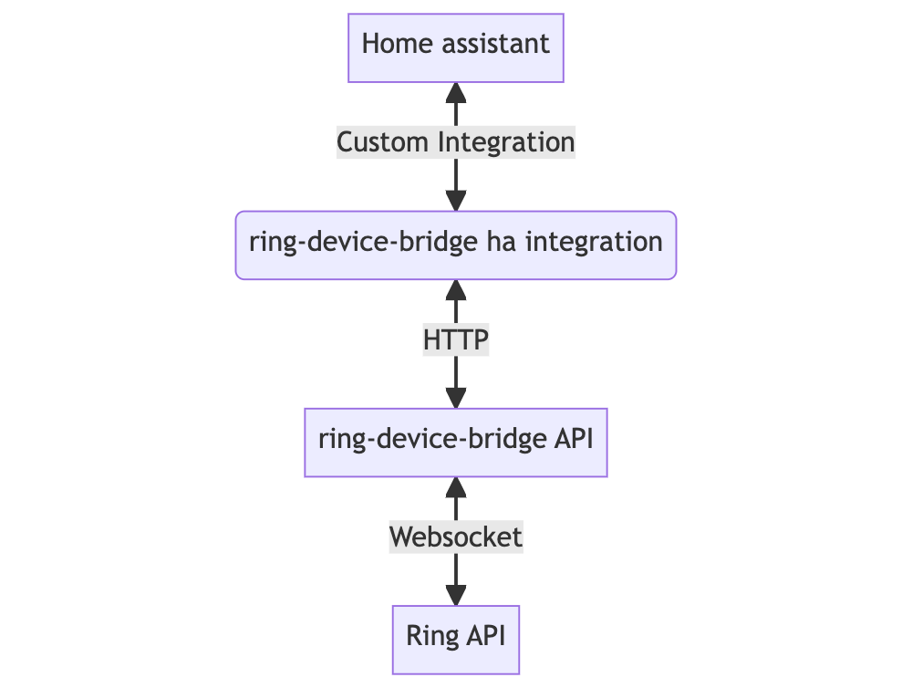

# Home assistant integrations
1. ring-device-bridge - Adds ring alarm compoents as entities in HA

## Ring Device Bridge Integration
This custom integration for home assistant adds the entities and devices exposed 
via the `ring-device-bridge` API



### Current supported features

#### Devices and entities
* Ring Contact sensors
  * **state** as a `binary_sensor` (ON / ENABLED == OPEN)
  * **battery** as a `sensor`
  * **bypassed** as a `binary_sensor` (whether this contact sensor is bypassed in the current alarm state)
* Smart lock integrated with ring
  * **state** as a `binary_sensor`
  * **battery** as a `sensor`
* Ring Alarm Control Panel
  * **state** as a `sensor`

#### Services
* **Control alarm state**. Ring only allows
   1. disarm
   2. arm home
   3. arm away
   
  **Caveat**: When arming the alarm system through the API, any open sensors will be bypassed
  to prevent the alarm from triggering immediately after being armed 

### Adding the integration

1. The [ring-device-bridge](https://github.com/anlawande/ring-home-assistant-bridge) API must be running and accessible via HTTP
2. Copy the `ring_device_bridge` folder in this repo to the custom components folder of your HA install. ([more info](https://developers.home-assistant.io/docs/creating_integration_file_structure#where-home-assistant-looks-for-integrations))
3. Add the following lines to your `configuration.yaml` file 
  ```
ring_device_bridge:
   api_host_and_port: "localhost:3123"
   api_token:
  ```
3. Change the host and port config to point to the running ring-device-bridge API
4. Populate the api token with the same used in ring-device-bridge (`.env` file)
5. Restart home assistant (if the UI complains about can't find custom component,
   then you may need to force restart the process for the first time)
6. The ring devices and entities should now be auto discovered and can be added individually
